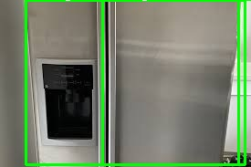

# Industrial Defect Detection System

An end-to-end computer vision pipeline for automated industrial inspection and defect detection. Generates structured inspection reports with severity classification and actionable recommendations — simulating real-world manufacturing quality control workflows.


## 📋 Overview

This project demonstrates a production-style automated inspection system capable of:

- Detecting objects and anomalies in industrial images using YOLOv8
- Classifying defect severity as HIGH, MEDIUM or LOW based on confidence and area
- Generating detailed structured inspection reports in the terminal
- Producing annotated output images with colour-coded bounding boxes
- Returning PASS / REVIEW / FAIL status with actionable recommendations

Designed to simulate quality control pipelines used in manufacturing, robotics, and industrial automation environments.

## 🖼️ Sample Output



## 📊 Sample Inspection Report

```
╔══════════════════════════════════════════════════════╗
║         INDUSTRIAL DEFECT INSPECTION REPORT          ║
╚══════════════════════════════════════════════════════╝

  Timestamp   : 2026-04-22 18:20:46
  Image       : sample_images/test.jpg
  Status      : FAIL

──────────────────────────────────────────────────────
  SUMMARY
──────────────────────────────────────────────────────
  Total defects found : 2
  HIGH severity       : 2
  MEDIUM severity     : 0
  LOW severity        : 0

──────────────────────────────────────────────────────
  RECOMMENDATION
──────────────────────────────────────────────────────
  ⛔ REJECT — High severity defects detected. Do not ship.
```

## 🎨 Severity Classification

| Severity | Condition |
|---|---|
| HIGH | Confidence > 80% or area > 10,000 px² |
| MEDIUM | Confidence > 50% or area > 5,000 px² |
| LOW | Below medium thresholds |

## 🔴 Inspection Status

| Status | Meaning |
|---|---|
| ✅ PASS | No defects detected |
| ⚠️ REVIEW | Low/medium severity defects — manual check advised |
| ⛔ FAIL | High severity defects — reject and do not ship |

## 🛠️ Tech Stack

- **Python** — Core language
- **YOLOv8 (Ultralytics)** — Object detection model
- **OpenCV** — Image processing and annotation
- **Custom report engine** — Structured inspection report generation

## 📁 Project Structure

```
industrial-defect-detection/
│
├── main.py               # Entry point — runs full inspection pipeline
├── detector.py           # DefectDetector class wrapping YOLOv8
├── report.py             # Inspection report generation engine
├── utils.py              # Image I/O and bounding box drawing
├── requirements.txt      # Project dependencies
├── sample_images/        # Test images
└── results/              # Annotated output images
```

## 🚀 Getting Started

### 1. Clone the repository
```bash
git clone https://github.com/aknashwin/industrial-defect-detection.git
cd industrial-defect-detection
```

### 2. Create and activate virtual environment
```bash
python -m venv venv
venv\Scripts\activate  # Windows
source venv/bin/activate  # Mac/Linux
```

### 3. Install dependencies
```bash
pip install -r requirements.txt
```

### 4. Run inspection on an image
```bash
python main.py --input sample_images/test.jpg
```

## ⚙️ Arguments

| Argument | Default | Description |
|---|---|---|
| `--input` | `sample_images/test.jpg` | Path to input image |
| `--output` | `results/output.jpg` | Path to save annotated output |
| `--confidence` | `0.3` | Detection confidence threshold (0-1) |

## 🔮 Future Improvements

- Train a custom YOLOv8 model on real industrial defect datasets (e.g. MVTec AD)
- Add support for video and real-time camera inspection
- Export inspection reports to PDF and CSV
- Build a web dashboard for live production line monitoring
- Integrate with PLCs and industrial control systems for automated reject handling
